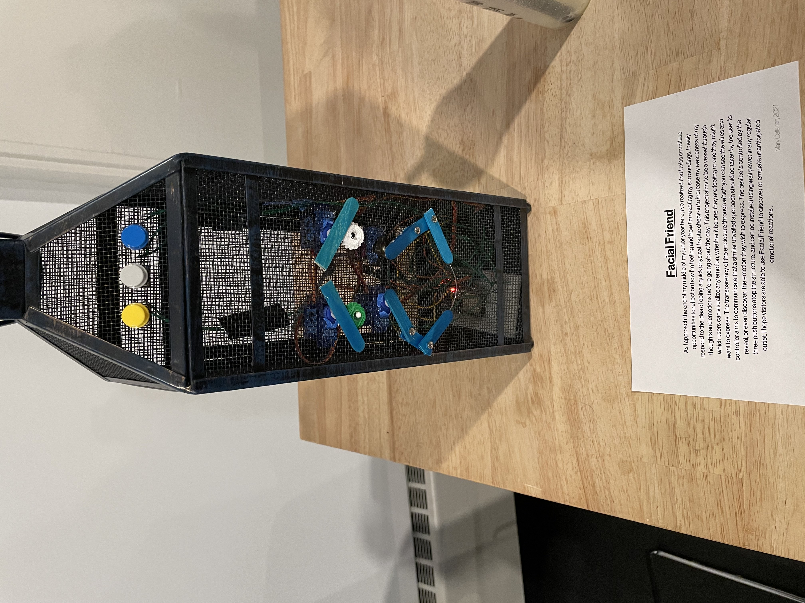

# Module 7: Facial Friend (Final Project)

This module was done as a final project for CPSC 334: Creative Embedded Systems at Yale University.

All code and other files relating to this project can be found in this repository.

## Overview

This device is meant to be used as a physical manifestation of emotions you might be feeling or might wish to express. It provides ample opportunity to reflect on how you or others around you are feeling, and it takes the form of a personable collection of hot glue, screws, and popsicle sticks. This project aims to be a vessel through which users can visualize any emotion, whether it be one they are feeling or one they might want to express. The transparency of the enclosure through which you can see the wires and controller aims to communicate that a similar unveiled approach should be taken by the user to reveal, or even discover, the emotion they wish to express. The device is controlled by the three push buttons atop the structure, and can be installed using wall power in any regular outlet.

## Hardware

- 4 x Servo Motors
- 1 x ESP32
- 1 x micro-USB cable connected to wall power

## Software

- Arduino

## How to Run

1. Upload the [`servo_face`](https://github.com/mgcallanan/cpsc334/blob/master/mesh/wifi_motor_esp/wifi_motor_esp.ino) code to the ESP that will be running the device.
2. Plug in the device, and enjoy!

## Video Demo

Follow [this link](https://youtu.be/_-7O1CU1CxU) to watch a video of Facial Friend in Action
