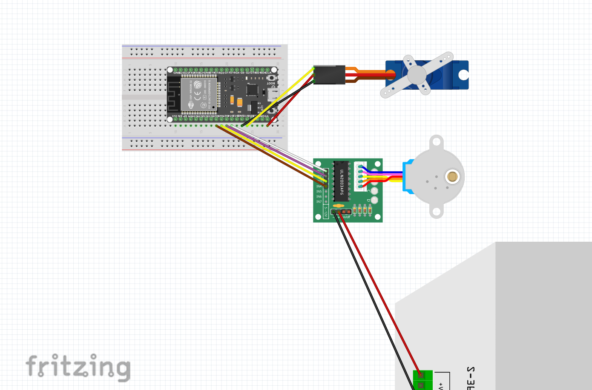

## Module 4/5: Task 1

The Arduino code for task 1 of this file can be found in the task1_code file above.

The wiring diagram (made via Fritzing) can be found below:

The actual fritzing diagram can be found in module45task1.fzz.
