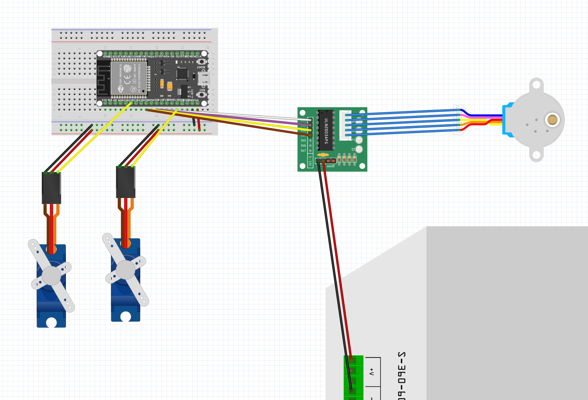

# Module 4/5: "Wait for Me" Mechanical Box

The code and other files in this repository are a part of the Module 4/5: Kinetic Sculpture assignment for CPSC 334: Creative Embedded Systems class at Yale University.

## Overview

The end result of the kinetic sculpture assignment for this project took the form of a mechnical box that narrates the ancient Greek myth of Orpheus and Eurydice. The rotational motion is inspired by the set design of [_Hadestown_](https://www.hadestown.com/), and the eponym of the piece is taken from a climactic song from the score.

The sculpture is powered by three motors connected to an ESP32 and using a DC 12V power supply for a bit of extra power. More hardware and software specifications and instructions can be found below.

## Hardware

### Stepper Motor

There is one stepper motor in the sculpture that powers the overall rotation of the two "character" elements of the piece. By using the stepper in conjunction with a Motor Driver and powering the motor directly off of the 12V power supply, the ESP32 is able to communicate rotational instructions and delays in order to facilitate a meaninful kinetic narrative.

I would advise other parties not to power the stepper directly off of a 12V power supply, as it makes the stepper motor itself quite hot, to the degree that it might melt other aspects of your system. Due to equipment constraints, I was not able to implement the use of a power regulator, which would have fixed this heat problem.

### Servo Motors

The two "characters" in this piece take the form of a red flower to represent Orpheus and a candle to represent Eurydice. Each moves in a rotational circle, but each is also attached to a servo motor to control its own individual motion. The flower rotates 180 degrees and the candle crumples (as the servo spins 90 degrees to press the button to activate this functionality) for every 360 degrees that the stepper rotates as the rose leads the candle.

### ESP32

The ESP32 in this module is used to power the two servos as well as control the motion of all three motors in the system. The wiring diagram can be found below:

The actual Fritzing file for this diagram can be found in the `wiring_diagram` folder in this repository.

The ESP32 itself is powered via a micro-USB to USB connection with a laptop, but options could be explored to make this connection more wireless-friendly.

### 3D Printing

This kinetic sculpture relies very heavily on 3D printing for some of the parts involved. The two rotational arms of the piece are connected to the stepper motor via a gear piece that was designed to fit the stepper motor. The entire "candle" push puppet structure was also 3D printed. The files that were used for 3D printing can be found in the `designs` folder of this repository.

### Laser Cutter

The box that acts as the enclosure for the device was creating using the laser cutter at the CEID. The engraving on the front of the box acts as the nameplate for the piece, and holes were drilled into multiple parts of the box to account for wiring and power needs. The file used to create this box can be found in `./designs/musicbox.cdr` in this repository.

## Software

The code used to run this kinetic sculpture is done using the Arduino IDE and `.ino` files, but it also makes special use of two libraries to control the motors.

### Stepper.h

Stepper.h is a library that comes built in with the Arduino IDE, so you shouldn't have to do any special installation in order to get this implementation up and running. It is used to control the Stepper motor off of the ESP32 and other Arduino devices. More information about this library can be found [on the Arduino website](https://www.arduino.cc/en/reference/stepper).

### ESP32Servo.h Library

An additional library has to be installed in order for the Arduino IDE to interact with the servo motors. ESP32Servo.h is a third party library, and installation instructions also be found [on the Arduino website](https://www.arduino.cc/reference/en/libraries/esp32servo/).

## Video Demo

Watch the video of the kinetic sculpture in action [here](https://www.youtube.com/watch?v=kWcm93v2cFg).
